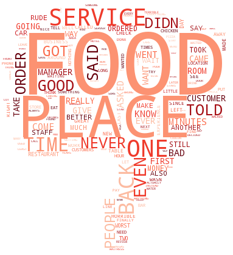
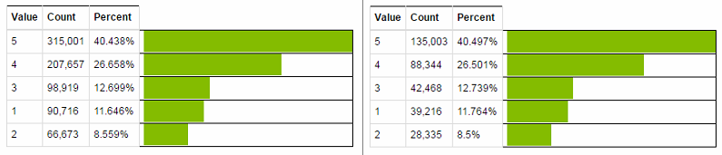
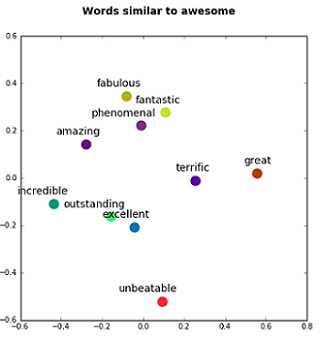
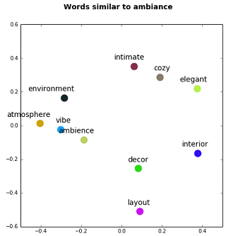
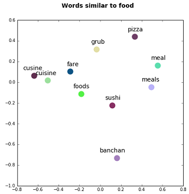
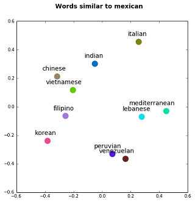
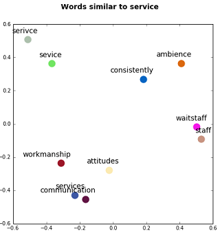
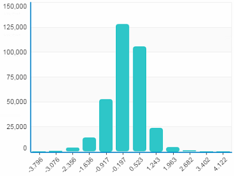
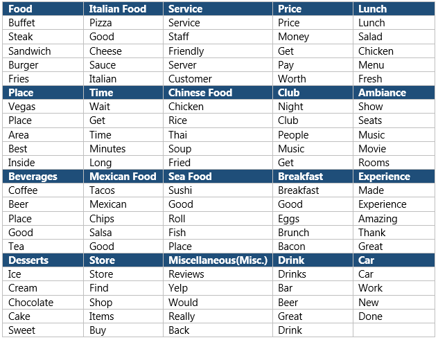
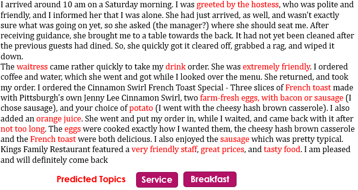

--- 
title       : Yelp Dataset Challenge 2016 Report
subtitle    : Review Text Analysis
author      : Zarmeen Nasim
supervisor  : Dr.Sajjad Haider
university  : Institute of Business Administation(IBA) ,Karachi,Pakistan
job         : 
framework   : io2012        # {io2012, html5slides, shower, dzslides, ...}
highlighter : highlight.js  # {highlight.js, prettify, highlight}
hitheme     : tomorrow      # 
widgets     : []            # {mathjax, quiz, bootstrap}
mode        : selfcontained # {standalone, draft}
knit        : slidify::knit2slides

--- 

## Introduction

In this report we have presented our analysis performed on review text provided by Yelp for Dataset Challenge 2016.We took the challenge to :

1. Predict Star Rating from review text alone
2. Extract aspects from review through topic modeling

--- .segue .dark .current

<hgroup>
  <h2> Review Star Rating Prediction </h2>
</hgroup>

--- 

## 1. Predict Star Rating from review text alone 

Business are often interested in the useful feedback provided by their valuable customers in       order to improve their services.Reading and evaluating each review on Yelp website is a             herculian task.Our star rating prediction model addresses this issue by predicting the star         rating (1-5) from the review text only.
 
 Workflow is described as follows:
 
 1. Data Description
 2. Data Cleaning
 3. Data visualization
 4. Data Partition 
 5. Feature Extraction
 6. Modeling
 7. Evaluation

--- 

## 1.1 Data Description

Review data was provided in json format.

<pre>
{
    'type': 'review',
    'business_id': (encrypted business id),
    'user_id': (encrypted user id),
    'stars': (star rating, rounded to half-stars),
    'text': (review text),
    'date': (date, formatted like '2012-03-14'),
    'votes': {(vote type): (count)},
}

</pre>

 Fig 1.1 : Star rating distribution 

There were 22,25,213 reviews presented in the dataset.However due to computational limitation we have performed our analysis on 50% of total reviews.
Figure 1.1 shows star rating distribution in the subset of review dataset.

--- 

## 1.2 Data Cleaning

For data cleaning,following steps were performed:

1. Removed stop words provided by nltk Stopword list, except following words  ['most','not','very','few','more','only','nor','too','but']
2. Removal of non alphanumeric characters
3. Lower case conversion
4. Stemming not applied as <b style="color:red">'awesome'</b> and <b style="color:red">'awesomeeeee'</b> may have different ratings
5. Removal of words having word length <=2 

--- 

## 1.3 Data Visualization

We first try to visualize the the difference between 5-star reviews and 1-star reviews by plotting their word clouds.

 Fig 1.2 : Thumbs up vs. Thumbs down reviews 

--- 

## 1.4 Data Partition

After data visualization,the next step was to partition our dataset into training and testing dataset.
Our split ratio was 0.7

<table style="width:auto">
  <tbody>
  <tr style="background:None;">
    <td> Training set </td>
    <td> 7,78,966 reviews </td>
  </tr> 
   <tr style="background:None;">
    <td> Testing set </td>
    <td> 3,33,366 reviews </td>
  </tr> 
</tbody>  
</table>

 

 Fig 1.3 : Train set and Test set Star rating Distribution

--- 

## 1.5 Vector Based Approach For Feature Extraction

We followed vector based approach to extract features from raw text.Word2vec <b style = "color:red">vectorizes</b> about words, and by doing so it makes natural language computer-readable - we can start to perform powerful mathematical operations on words to detect their similarities

- Word2vec, published by Google in 2013, is a neural network implementation that learns distributed representations for words.
- Word2vec is an unsupervised learning approach that clusters similar words together.
- In this project,word2vec implementation of <b>genism package </b> is used.
Word2vec model was trained on training data i.e 7,78,966 reviews

<table style="width:auto">
<thead>
  <th> Parameter </th>
  <th> Value </th>
</thead>
<tbody>
  <tr>
    <td>Features</td>
    <td>500</td>
  </tr>
  <tr>
    <td>Minimum word count</td>
    <td>20</td>
  </tr>
  <tr>
    <td>Workers</td>
    <td>6</td>
  </tr>
  <tr>
    <td>Context</td>
    <td>10</td>
  </tr>
   <tr>
    <td>Downsampling</td>
    <td>1e-3</td>
  </tr>
</tbody>
</table>

---

## 1.5.1 Word2Vec Visualization

We apply Principal Component Analysis to reduce the dimension to 2 for visualizating the query result of our word2vec model.

<table style="border:1px solid rgba(0, 0, 0, 0.45)">
  <tbody>
    <tr style = "background:None;">
      <td>
        
      </td>
       <td>
       
      </td>
      <td>
      
      </td>
    </tr>
  </tbody>  
</table>

 Fig 1.4 : Word2Vec Visualization

---  

## 1.5.1 Word2Vec Visualization

We apply Principal Component Analysis to reduce the dimension to 2 for visualizating the query result of our word2vec model.

<table style="border:1px solid rgba(0, 0, 0, 0.45)">
  <tbody>
    <tr style = "background:None;">
      <td>
        
      </td>
       <td>
       
      </td>
      <td>
      
      </td>
    </tr>
  </tbody>  
</table>

 Fig 1.5 : Word2Vec Visualization

--- 

## 1.6 Modeling

Before modeling,the first task was to decide that whether star rating prediction should be treated as a <b style="color:red">MultiClass Classification</b> problem or should we consider it <b style="color:red">Regression </b> problem.

We first train our model using <b style="color:red"> Xgboost Multiclass Classification Algorithm </b> but the results are worse ,moreover the training time was almost double as compared with <b style="color:red"> Xgboost Regression Algorithm </b>.

The reason behind this difference in performance is:

- Classification algorithms associate same cost to misclassifying 5-star review as 1-star review or   4-star review ,which is not right.

- In regression,we consider that predicting 5-star review as a 4-star review is less costly rather    than predicting it as a 1-star review.

- Thus regression algorithms assign different penalty to different mistakes depending upon how far    we are from correct answer.

---

## 1.6.1 XGBOOST Regression Algorithm

<a href='https://github.com/dmlc/xgboost/tree/master/python-package'>XGBOOST Python Implementation </a>

After training several regressors with different parameter settings,the best so far model trained has the following parameter settings

<table style="width:auto">
<thead>
  <th> Parameter </th>
  <th> Value </th>
</thead>
<tbody>
  <tr>
    <td>eta</td>
    <td>0.01</td>
  </tr>
  <tr>
    <td>Max depth</td>
    <td>10</td>
  </tr>
  <tr>
    <td>min-child-weight</td>
    <td>15</td>
  </tr>
  <tr>
    <td>Subsample</td>
    <td>0.8</td>
  </tr>
   <tr>
    <td>colsample_bytree</td>
    <td>0.8</td>
  </tr>
   <tr>
    <td>seed</td>
    <td>12</td>
  </tr>
     <tr>
    <td>silent</td>
    <td>False</td>
  </tr>
  <tr>
    <td>objective</td>
    <td>reg:linear</td>
  </tr>
  <tr>
    <td>num_trees</td>
    <td>12,000</td>
  </tr>
</tbody>
</table>

 Table 1.6.1 : Parameter details of Best so far Model

---

## 1.7 Experimental Design

We first performed XGBOOST Classifier on extracted features which took 48 hours for training and giving <b style="color : red"> 62% accuracy </b> on the machine with following configuration.

<table> 
  <tbody>
    <tr>
    <td> RAM </td>
    <td> 8 GB </td>
    </tr>
    <td> Processor </td>
    <td> Core i5 </td>
    </tr>
    <td> OS </td>
    <td> Windows 7 </td>
    </tr>
</table>

Whereas, XGBOOST REgressor took 2-3 hrs for training to give <b style="color : red"> 0.69 R-Squared </b>

---

## 1.8 Evaluation

Model is evaluated on our test set containing <b> 3,33,366 reviews </b>

<table style="width:auto">
<thead>
  <th></th>
  <th> MSE </th>
  <th> RMSE </th>
  <th> R-Score </th>
</thead>
<tbody>
  <tr>
    <td>Xgboost Regressor</td>
    <td>0.5695</td>
    <td>0.754</td>
    <td>0.695</td>
  </tr>
  <tr>
    <td>RandomForest Regressor</td>
    <td>0.867</td>
    <td>0.931</td>
    <td>0.536</td>
  </tr>
</tbody>
</table>

#### Confusion Matrix
Star rating prediction from our xgboost regression model is rounded off and we compute confusion matrix of our predicted ratings and actual star ratings.

 Fig 1.6 : Confusion Matrix

--- 

## 1.8 Evaluation

#### Histogram of Error Values

<b style = "color:red">Error = Actual Star Rating - Predicted Star Rating</b>

 Fig 1.7 : Histogram of Error Values  

---

## 1.8 Evaluation

#### Comparing Actual Star Rating with Average of Predicted Star Rating

We then compute average of predicted ratings grouped by their actual star ratings.This helped us in understanding when the model performs well and when it does not.

 Fig 1.8 : Actual vs. Average Predicted Star Ratings

--- .segue .dark .current

<hgroup>
  <h2> Topic Extraction From Review </h2>
</hgroup>

--- 

## 2. Extract aspects from review through topic modeling

The next task we performed was to extract important aspect from review text.The intent of this      task is twofold

- Provide aspect level summary of reviews.  

- Auto tag each review with its aspect so that new customer can search reviews that contain           aspect of interest

---

## 2.1 Problem Statement

It is often observed that reviews are verbose.It requires alot of effort for a site visitor or a business owner to go through a large number of long reviews to extract meaningful aspects and topics contained in a review.For example,consider a following review taken from Yelp Dataset 

I arrived around 10 am on a Saturday morning.  I was greeted by the hostess,who was polite and friendly, and I informed her that I was alone.  She had just arrived, as well, and wasn't exactly sure what was going on yet, so she asked (the manager?) where she should seat me.  After receiving guidance, she brought me to a table towards the back.  It had not yet been cleaned after the previous guests had dined.  So, she quickly got it cleared off, grabbed a rag, and wiped it down.

The waitress came rather quickly to take my drink order.  She was extremely friendly.  I ordered coffee and water, which she went and got while I looked over the menu.  She returned, and took my order.  I ordered the Cinnamon Swirl French Toast Special - Three slices of French toast made with Pittsburgh's own Jenny Lee Cinnamon Swirl, two farm-fresh eggs, with bacon or sausage (I chose sausage), and your choice of potato (I went with the cheesy hash brown casserole).  I also added an orange juice.  She went and put my order in, while I waited, and came back with it after not too long.   The eggs were cooked exactly how I wanted them, the cheesy hash brown casserole and the french toast were both delicious.  I also enjoyed the sausage which was pretty typical.

Kings Family Restaurant featured a very friendly staff, great prices, and tasty food.  I am pleased and will definitely come back again.

---

## 2.2 Solution - Topic Modeling

To extract meaningful aspects from a review text, a statistical approach known as <b style="color:red">Topic Modeling </b> is used in this project.

Topic Models assume that a document can be described by a small set of topics/aspects and there is a probability of any word occurring for a given "topic".

A topic model first learns the topics by clustering words that co-occur and then learn the probabilities defining how much each document belongs to each topic.

In this project,we have used Dato Graph Lab Topic Modeling implementation of LDA (Latent Dirichlet allocation) 

---

## 2.3 Topic Modeling

To perform the task of extracting topics from review corpus, following workflow was followed

1. Text preprocessing
2. Data Partition 
3. Topic model Training
4. Topic Prediction 
5. Topic Visualization
6. Further Analysis

---

## 2.3.1 Text Preprocessing

For data cleaning,following steps were performed:

1. Removed stop words provided by nltk Stopword list.
2. Removal of non alphanumeric characters
3. Lower case conversion
4. Removal of words having word length <=2 
5. Tokenization

## 2.3.2 Data Partition

After text preprocessing,review dataset was partitioned into training set and test set.Our split ratio was 0.6.

<table style="width:auto">
  <tbody>
  <tr style="background:None;">
    <td> Training set </td>
    <td> 13,35,128 reviews </td>
  </tr> 
   <tr style="background:None;">
    <td> Testing set </td>
    <td> 8,90,085 reviews </td>
  </tr> 
</tbody>  
</table>

---

## 2.3.3 Topic Model Training

For topic modeling, graphlab implementation of LDA is used.We seed our model with initial list of words associate with cluster/topic labels.

<table style="width:auto" class = "topiclabel" >
  <thead>
      <th> Word  </th>
      <th> Topic </th>
      <th> Word  </th>
      <th> Topic </th>
  </thead>
  <tbody>
    <tr>
      <td>food</td>
      <td>1</td>
      <td>staff</td>
      <td>3</td>
    </tr>
    <tr>
      <td>italian</td>
      <td>2</td>
      <td>worker</td>
      <td>3</td>
    </tr>
    <tr>
      <td>pasta</td>
      <td>2</td>
      <td>price</td>
      <td>4</td>
    </tr>
    <tr>
      <td>pizza</td>
      <td>2</td>
      <td>money</td>
      <td>4</td>
    </tr>
    <tr>
      <td>service</td>
      <td>3</td>
      <td>lunch</td>
      <td>5</td>
    </tr>
  
  </tbody>
  
</table>

 Table 2.1:Seeded Word Association 

<table style="width:auto" class = "topiclabel">
  <thead>
      <th> Parameter  </th>
      <th> Value </th>
      
  </thead>
  <tbody>
    <tr>
    <td> Number of Topics</td>
    <td> 50 </td>
    </tr>
    <tr>
    <td> Iterations</td>
    <td> 5000 </td>
    </tr>
    
    
  </tbody>
  
</table>

 Table 2.2: Model Parameters 

---

## 2.3.4 Top 5 Words for 20 Topics

 

 Fig 2.1: Top 5 words for each Topic 

---

## 2.3.5 Topic Visualization
<table  class ="wcloud">
  <tbody>
    <tr style = "background:None;">
      <td style="text-align:center">
        
      </td>
       <td style="text-align:center">
       
      </td>
  </tr>
  <tr style = "background:None;">
  <td style="text-align:center">
  
  Food 
  </td>
  <td style="text-align:center">
  
  Place 
  </td>
  </tr>
  </tbody>  
</table>

---

## 2.3.5 Topic Visualization
<table class="wcloud">
  <tbody>
    <tr style = "background:None;">
      <td style="text-align:center">
        
      </td>
       <td style="text-align:center">
       
      </td>
  </tr>
  <tr  >
  <td style="text-align:center">
  
  Ambiance 
  </td>
  <td style="text-align:center">
  
  Sea Food
  </td>
  </tr>
  </tbody>  
</table>

---

## 2.3.5 Topic Visualization
<table class="wcloud">
  <tbody>
    <tr style = "background:None;">
      <td style="text-align:center">
        
      </td>
       <td style="text-align:center">
       
      </td>
  </tr>
  <tr  >
  <td style="text-align:center">
  
  Service 
  </td>
  <td style="text-align:center">
  
  Beverages 
  </td>
  </tr>
  </tbody>  
</table>

--- 

## 2.3.6 Topic Prediction

After the model is trained,it predicts the topic for each review in a test set.We get 50 clusters/topics of similar words.
After merging clusters with similar words,We then assign topics labels,a meaningful name based upon the words in that cluster.There were 20 topics after postprocessing model results.
<b style="color:red">For e.g: ['pizza','good','cheese','sauce','italian'] => "Italian Food"</b>

 

 Fig 2.1: Predicted Topics on a Sample Review 

---

## 2.3.7 Topic Distribution in Overall Reviews
Out of curiousity,we find out most frequent topics in review dataset.Histogram below shows the distribution of aspects/topics in overall review dataset.

 

 Fig 2.2: Topic Frequency in Review Dataset  

--- .segue .dark .current

<hgroup>
  <h2> Thank you </h2>
</hgroup>
